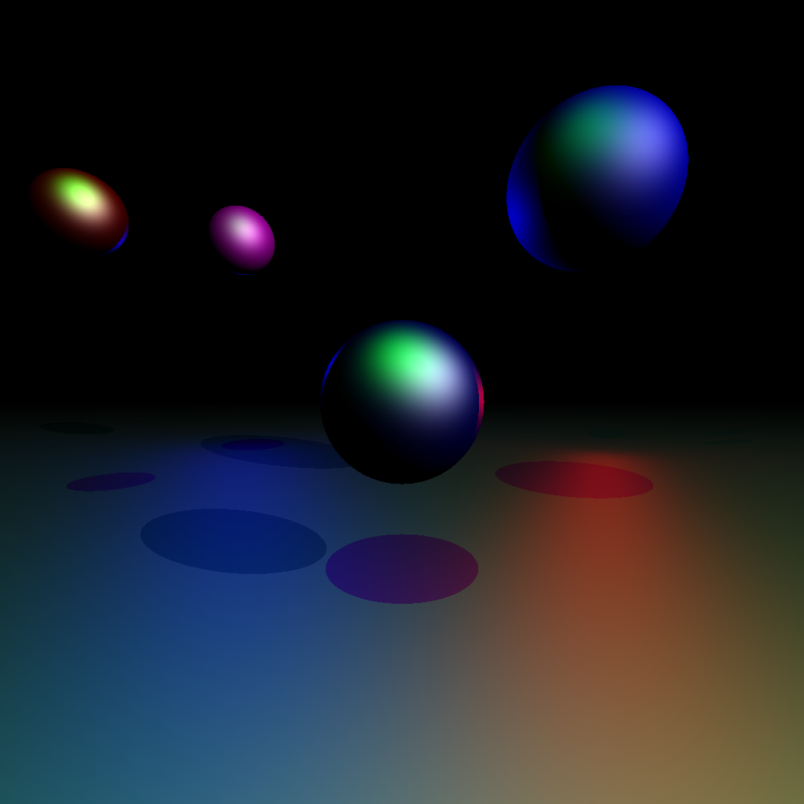

# rayblaster
A multithreaded ray tracer written in Rust.

## Example render


## Usage
The following command line arguments **must** be passed to ```rayblaster```:
-  ```-o```, ```--output``` The path to store the render image to
-  ```-s```, ```--scene``` The scene to render
-  ```-w```, ```--width``` The width of the output image
-  ```-h```, ```--height``` The height of the output image
-  ```-f```, ```--fov``` The FOV of the output image

The following command line arguments **may** be passed to ```rayblaster```:
- ```-t```, ```--threads``` The number of worker threads to spawn (defaults to
  the number of CPUs)
